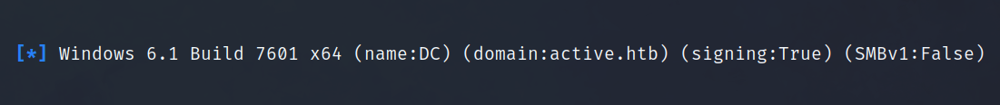
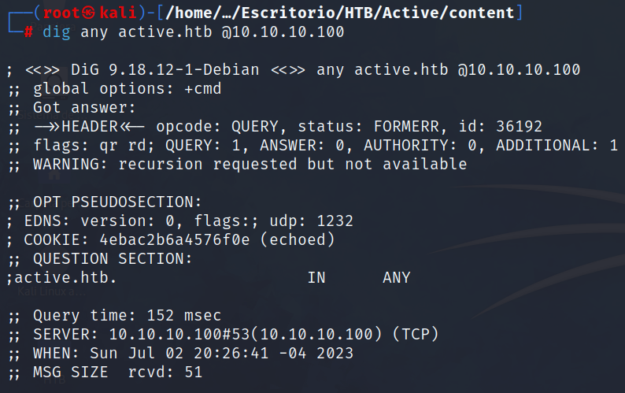

Máquina de directorio activo, enumeración del servicio SMB, Credenciales GPP y Kerberoasting.

## Enumeración
### Nmap
Empleando el comando `nmap -p- --open 10.10.10.100` podemos escanear todo el rango de puertos existentes y que solo nos reporte los puertos abiertos de la máquina.

Agregando las flags `-sC` y `-sV` a los puertos descubiertos, podemos lanzar una serie de scripts básicos de reconocimiento para ver los servicios que corren para esta máquina y sus respectivas versiones.

```bash
root@kali: nmap -p 53,88,135,139,389,445,464,593,636,3268,3269,5722,9389,47001,49152,49153,49154,49155,49157,49158,49165,49166,49168 -sC -sV -oN target.txt 10.10.10.100
```

```
Nmap scan report for 10.10.10.100
Host is up (0.18s latency).

PORT      STATE SERVICE       VERSION
53/tcp    open  domain        Microsoft DNS 6.1.7601 (1DB15D39) (Windows Server 2008 R2 SP1)
| dns-nsid: 
|_  bind.version: Microsoft DNS 6.1.7601 (1DB15D39)
88/tcp    open  kerberos-sec  Microsoft Windows Kerberos (server time: 2023-07-02 20:58:34Z)
135/tcp   open  msrpc         Microsoft Windows RPC
139/tcp   open  netbios-ssn   Microsoft Windows netbios-ssn
389/tcp   open  ldap          Microsoft Windows Active Directory LDAP (Domain: active.htb, Site: Default-First-Site-Name)
445/tcp   open  microsoft-ds?
464/tcp   open  kpasswd5?
593/tcp   open  ncacn_http    Microsoft Windows RPC over HTTP 1.0
636/tcp   open  tcpwrapped
3268/tcp  open  ldap          Microsoft Windows Active Directory LDAP (Domain: active.htb, Site: Default-First-Site-Name)
3269/tcp  open  tcpwrapped
5722/tcp  open  msrpc         Microsoft Windows RPC
9389/tcp  open  mc-nmf        .NET Message Framing
47001/tcp open  http          Microsoft HTTPAPI httpd 2.0 (SSDP/UPnP)
|_http-server-header: Microsoft-HTTPAPI/2.0
|_http-title: Not Found
49152/tcp open  msrpc         Microsoft Windows RPC
49153/tcp open  msrpc         Microsoft Windows RPC
49154/tcp open  msrpc         Microsoft Windows RPC
49155/tcp open  msrpc         Microsoft Windows RPC
49157/tcp open  ncacn_http    Microsoft Windows RPC over HTTP 1.0
49158/tcp open  msrpc         Microsoft Windows RPC
49165/tcp open  msrpc         Microsoft Windows RPC
49166/tcp open  msrpc         Microsoft Windows RPC
49168/tcp open  msrpc         Microsoft Windows RPC
Service Info: Host: DC; OS: Windows; CPE: cpe:/o:microsoft:windows_server_2008:r2:sp1, cpe:/o:microsoft:windows

Host script results:
| smb2-time: 
|   date: 2023-07-02T20:59:34
|_  start_date: 2023-07-02T20:46:13
| smb2-security-mode: 
|   210: 
|_    Message signing enabled and required
```

Gracias a que vemos los servicios de DNS, Kerberos, SMB y LDAP expuestos, podemos deducir que nos encontramos ante un DC (Domain Controller).

> Con el comando `crackmapexec smb 10.10.10.100` podemos ver información relevante del DC.
{: .prompt-tip }


- OS: Windows 6.1 x64
- Nombre: DC
- Dominio: active.htb

> Debido a que nos encontramos ante una máquina de Directorio Activo debemos agregar el dominio (active.htb) al archivo _/etc/hosts_ de nuestra máquina de atacante.
{: .prompt-info}

### DNS
Podemos enumerar el servicio DNS para ver si vemos información interesante o si podemos realizar un ataque de transferencia de zona (AXFR).
```bash
root@kali: dig any active.htb @10.10.10.100
```

Pero no vemos nada de valor, asi que avanzamos al siguiente servicio.

### SMB
Si listamos los recursos disponibles de red con el comando `smbmap -H 10.10.10.100` vemos que tenemos permiso de lectura en el recurso **Replication**.


Listando el contenido dentro de la carpeta **Replication/active.htb** con el comando `smbmap -H 10.10.10.100 -r 'Replication/active.htb'` vemos una serie de carpetas de lo que parece ser un backup de **SYSVOL**.


### Credenciales GPP


> GPP (Group Policy Preferences) es una herramienta que proporciona algunas capacidades avanzadas a los administradores para configurar y gestionar la política de cuentas en una red de dominio de Windows.

Estas políticas les permiten configurar cuentas locales, e incrustar credenciales para varios propósitos que de otra manera podrían requerir una contraseña incrustada en un script. Así, cuando se genera una nueva preferencia de directiva de grupo (GPP), se crea un archivo xml (generalmente **Groups.xml**) con los datos de configuración, incluidas las contraseñas asociadas a la GPP, en el recurso compartido **SYSVOL**, que son carpetas de los controladores de dominio accesibles y legibles para todos los usuarios autenticados de dominio.

> Como medida de seguridad, Microsoft cifra la contraseña mediante AES antes de almacenarla como **"cpassword"**. Pero las claves están disponibles públicamente en [MSDN!](https://learn.microsoft.com/en-us/openspecs/windows_protocols/ms-gppref/2c15cbf0-f086-4c74-8b70-1f2fa45dd4be).
{: .prompt-tip}

_fuente: [https://infosecwriteups.com/attacking-gpp-group-policy-preferences-credentials-active-directory-pentesting-16d9a65fa01a](https://infosecwriteups.com/attacking-gpp-group-policy-preferences-credentials-active-directory-pentesting-16d9a65fa01a)_